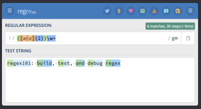

# Useful tools for developers:

## Quick Links:
<a href="#regex">Regular Expressions</a>

- Regular expression tester with syntax highlighting, explanation, cheat sheet for PHP/PCRE, Python, GO, JavaScript, Java. Features a regex quiz & library.

    <a href="https://regex101.com/">Regex101.com</a>

    